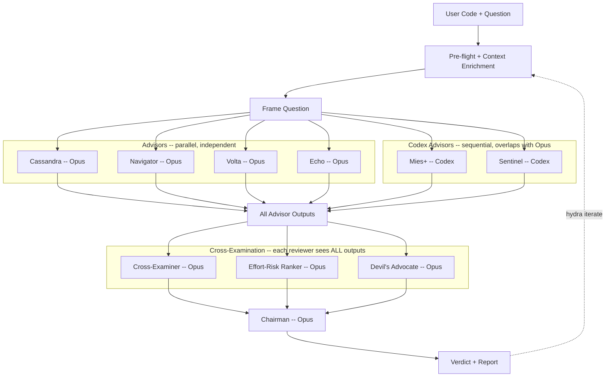

# Hydra

**Your code review has blind spots. Use more eyes.**

[](LICENSE)
[](https://docs.anthropic.com/en/docs/claude-code/skills)
[](#modes)

Three engineers reviewed this code. Hydra caught what they missed -- twice, from two models that never talked to each other.

Four advisors review your code by default (standard mode). Escalate to deep mode
for six specialists, three cross-examining reviewers, and cross-model diversity.
Inspired by [Karpathy's LLM Council](https://github.com/karpathy/llm-council) --
same principle (independent perspectives, cross-examination, synthesis), adapted
for specialist code review with cross-model diversity (Claude Opus + OpenAI Codex).

---

## What You Get

```
## Hydra Verdict: auth-middleware-refactor

**Solid refactor with one critical gap in token refresh handling.**
**Confidence:** 82% (HIGH)

The middleware correctly centralizes auth checks, but the refresh token
flow has a race condition under concurrent requests -- Cassandra and
Sentinel (cross-model consensus) both flagged this independently.
Mies+ identified two abstraction layers that can be collapsed.

**Top Actions:**
1. [C-1, S-3] Add mutex around token refresh in auth/middleware.ts:47-62 [effort: small]
2. [M-1] Remove SessionValidatorFactory -- inline the 3-line check (auth/validators.ts) [effort: trivial]
3. [C-2] Add integration test for concurrent refresh scenario [effort: medium]

**Key Tensions:**
- Navigator vs Mies+ on separating auth/authz modules. Ruling: keep combined
  until a second consumer exists.

Full report: .hydra/reports/hydra-20260331T144523-auth-middleware-refactor.md
```

**Best for:** Architecture decisions, security-critical code, refactoring tradeoffs,
pre-merge deep reviews.
**Just ask Claude for:** Syntax fixes, factual lookups, code generation, style questions.

---

## How It Works



In standard mode (default), four advisors analyze independently and a chairman synthesizes a verdict. In deep mode, six advisors run (four Opus in parallel, two Codex sequentially), then three reviewers cross-examine all outputs (no advisor sees another's work, but every reviewer sees everything), then the chairman synthesizes. After fixes, `hydra iterate` re-enters the pipeline in standard mode, producing a delta of what changed. Costs and agent counts are summarised in the [Modes](#modes) table below.

---

## Quick Start

```bash
# Install
git clone https://github.com/Zandereins/hydra.git ~/.claude/skills/hydra

# Review
hydra this: [paste code or describe decision]

# Fix issues, then iterate
hydra iterate
```

Hydra asks for cost confirmation before running. Auto-detects Codex; falls back to
Opus-only if unavailable. Iterations default to standard mode and show a
delta: what's fixed, what remains, what's new.

**Requirements:** [Claude Code](https://claude.ai/code) (required) |
[Codex CLI plugin](https://github.com/openai/codex-plugin-cc) (optional -- enables
cross-model analysis, runs sequentially alongside Opus advisors)

---

## The Advisors

Standard mode uses 4 advisors (Cassandra, Mies+, Sentinel, Echo), all on Claude Opus.
Deep mode adds Navigator and Volta for the full 6 and runs two of them (Mies+, Sentinel)
on OpenAI Codex -- different model, different blind spots. When Opus and Codex
independently agree, that's the strongest signal. When they disagree, that's the
highest-value finding.

Each finding gets a unique ID (e.g., C-1 for Cassandra's first finding, M-2 for
Mies+'s second). Top Actions reference these IDs so you can trace any recommendation
back to the advisor who raised it.

| # | Name | Model | Core Question |
|---|------|-------|---------------|
| 1 | Cassandra | Opus | "How does this break at 3am?" -- compound failures, unguarded assumptions |
| 2 | Mies+ | Codex | "What can be removed, and can a stranger follow it?" -- dead code, over-engineering, readability |
| 3 | Navigator | Opus | "What depends on what?" -- coupling, boundary violations |
| 4 | Volta | Opus | "What does this cost at 10x load?" -- N+1 queries, invisible costs |
| 5 | Sentinel | Codex | "How do I break this on purpose?" -- auth gaps, injection, race conditions |
| 6 | Echo | Opus | "What did the AI get wrong?" -- phantom code, fake tests, plan-vs-diff drift |

Mies+ uses a few-shot prompt format for Codex compatibility (deep mode). Top Actions
include effort tags (`[effort: trivial]`, `[effort: small]`, `[effort: medium]`,
`[effort: large]`) ranked by the Effort-Risk Ranker reviewer.

Advisors run in parallel (Opus) and sequentially (Codex), then 3 peer reviewers
cross-examine their work (all Opus), then a chairman (Opus) synthesizes the final
verdict.

---

## Modes

| Mode | CLI | Agents | Est. Cost |
|------|-----|--------|-----------|
| **standard** *(default)* | -- | 5 (4 advisors + chairman) | around $0.35-0.65 |
| **deep** | `--mode deep` | 10 (6 advisors + 3 reviewers + chairman) | around $1.50-2.50 |

**Modifiers** (combinable with either mode):
- `--no-codex` -- Codex advisors run on Opus instead
- `--no-review` -- skip peer review (only meaningful with deep, reduces to 7 agents, around $1.00)
- `--transcript` -- save raw agent outputs separately

**Focus flags:** `--focus security|perf|readability|architecture|reliability` -- gives the primary advisor 2x word budget. Mapping: security to Sentinel, perf to Volta, readability to Mies+, architecture to Navigator, reliability to Cassandra. Flags for `perf` and `architecture` auto-escalate to deep mode (those advisors only exist in deep).

Costs are API calls to Claude and Codex, charged to your own accounts. Hydra always
shows the estimate and asks before running.

---

## Auto-Mode

Let Hydra analyze your question and recommend the right mode:

```
hydra ?    # analyze your question, recommend a mode
hydra auto # same
```

---

## Post-Review Actions

After a Hydra verdict, act on findings directly:

```
fix #1       # implement Top Action #1 directly
fix #2       # implement Top Action #2
hydra iterate # re-review after fixes
```

---

## Branch Review

Review all changes on the current branch compared to main:

```
hydra branch   # review current branch vs main
```

---

## Iterate

Hydra reviews aren't one-shot. Fix the issues, then run `hydra iterate` to verify:

```
## Hydra Delta: auth-middleware-refactor

**Progress: 2/3 previous actions addressed**

**Fixed:** Mutex added around token refresh. SessionValidatorFactory removed.
**Remaining:** Integration test for concurrent refresh not yet added.
**New Issues:** None.

**Next Step:** Add test in auth/__tests__/refresh.test.ts
```

Iterations auto-detect the last report, diff only what changed, and default to
standard mode. Run as many cycles as needed (see the [Modes](#modes) table for cost).

Triggers: `hydra iterate`, `hydra re-review`, `hydra follow-up`, `check my fixes`.

---

## Privacy

In deep mode, your code is sent to both Anthropic (Claude Opus) and OpenAI
(Codex GPT-5.4); standard mode is Opus-only (Anthropic only). Use `--no-codex` to
keep deep mode Anthropic-only as well. Hydra shows which providers receive your code
and asks for confirmation before any agents run.

Without the Codex plugin, Hydra runs all advisors on Opus. In standard mode that is
4 advisors + chairman (5 agents). In deep mode, all 6 advisors + 3 reviewers + chairman
(10 agents). Same perspectives -- just without cross-model diversity.

---

## When NOT to Use Hydra

Hydra spawns 5-10 agents. Use it for decisions that benefit from multiple
perspectives -- not everything.

**Just ask Claude directly for:** syntax fixes, single-file refactors, code generation,
factual lookups, style questions, simple bug fixes with obvious root causes.

**Use Hydra for:** architecture decisions with real tradeoffs, security-critical code,
complex refactoring, pre-merge reviews, "I've been staring at this for hours" situations,
code where mistakes have high cost (payments, auth, data migration).

**Rule of thumb:** If you can describe the change in one sentence and the approach is
obvious, you don't need Hydra.

---

## Troubleshooting

**"Codex script not found"** -- Hydra auto-switches to Opus-only. All 6 perspectives
still run. Install the [Codex CLI plugin](https://github.com/openai/codex-plugin-cc)
for cross-model analysis.

**Codex advisors timing out** -- Fixed. Codex tasks now run sequentially
(the codex-companion CLI allows only one active task per workspace). If Codex
still fails, Hydra auto-switches to Opus-only. Use `--no-codex` to skip Codex entirely.

**"Codex circuit breaker open"** -- Hydra detected 2+ consecutive Codex failures
and switched to Opus-only for the rest of the session. This is automatic --
your review continues without interruption.

**"ABORTED: 0/N advisors responded"** -- API key or network issue. Verify Claude access
works outside Hydra.

**Unexpected activation** -- Type `n` at the cost confirmation. Hydra always asks before
spawning agents.

---

## FAQ

**How much does it cost?** Standard: around $0.35-0.65. Deep: around $1.50-2.50. These are API
costs charged to your accounts. Hydra shows estimates before running.

**Where are reports?** `.hydra/reports/` in your project root (gitignored). Run
`hydra history` to list past reviews.

**Without Codex?** All 6 advisors run on Opus (10 agents total with 3 reviewers).
Same perspectives, no cross-model signal. Use `--no-codex` to keep code Anthropic-only.

**How do iterations work?** Fix issues, run `hydra iterate`. Hydra diffs what changed,
defaults to standard mode, shows a delta: fixed / remaining / new.

**How many reviewers?** 3 reviewers (Cross-Examiner, Effort-Risk Ranker,
Devil's Advocate), all running on Opus.

---

## License

MIT
