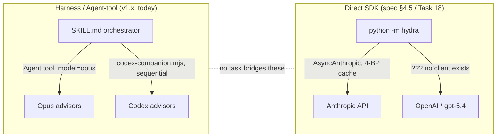

# ADR 0001 — Execution Substrate for Hydra 2.0 Advisors

- **Status:** Accepted (Option C — Hybrid), 2026-05-23
- **Date:** 2026-05-23
- **Deciders:** Franz
- **Supersedes:** —
- **Context source:** 4-agent parallel evaluation 2026-05-23 (integration-risk, scope/value, security, blocker-catalog)

## Context

Hydra 2.0 is being built as a Python engine (`hydra/`) underneath the existing
Claude-Code skill (`SKILL.md`). A multi-agent evaluation surfaced a **verified
architectural contradiction**: the live product and the planned engine assume two
incompatible ways of *running an advisor*, and no task in the 44-task plan
reconciles them.

### The two substrates that exist today

**Harness / Agent-tool (the live v1.x product, `SKILL.md`):**
Advisors are spawned via the Claude-Code **Agent tool** (`Spawn via Agent tool with
model: "opus"`, see SKILL.md Step 3 advisor dispatch). Codex advisors run through a
`codex-companion.mjs` subprocess, **sequentially** (single active task —
`SKILL.md:343`). This runs *inside the harness*: no `ANTHROPIC_API_KEY`, no direct
HTTP, billed under the user's Claude plan rather than per-token API cost.

**Direct SDK (the engine, spec §4.5 + plan Task 18):**
The spec deliberately chose a *standalone Python program*: a single asyncio event
loop + `asyncio.TaskGroup` + `anthropic.AsyncAnthropic` + per-model semaphores
(spec §4.5, `:264-284`) — including a `SEM_OPENAI` semaphore (`:283`), so OpenAI/Codex
was *intended* but its client was never specified. Plan Task 18 builds
`build_advisor_request(model="claude-opus-4-7")` and `model="gpt-5.4")` for direct
`messages.create()` calls with a **release-blocking 4-breakpoint prompt-cache layout**
(spec §4.3.1) and a `Budget` class reading `usage.*_tokens`.

### Why this blocks everything

A single unresolved substrate choice simultaneously determines:
- whether the **prompt-cache cost model** (4-BP layout, ≥60% cache-hit
  release gate, `Budget`) is real or dead — the Agent tool exposes no
  `cache_control` and no token `usage`;
- whether the **concurrency engine** (`TaskGroup`, semaphores, watchdogs,
  `concurrency.py`, `seeder.py` — none built yet) is the right shape;
- whether a **Codex/OpenAI client** must be built in Python, or Codex stays
  on `codex-companion.mjs`;
- whether the **cross-family `--tensions` feature** (Anthropic vs OpenAI
  disagreement) has two real providers to compare.

Building 30+ more tasks against the unstated assumption and discovering the seam
at Task 43 (pipeline glue) is the integration anti-pattern this ADR exists to avoid.

## Decision drivers

1. **Cost.** Interactive `/hydra` under the harness is billed under Franz's Claude
   plan (effectively no marginal per-review API cost). Direct SDK spends real money
   per review (spec budgets ~$2/review; bench ~$18-25/run).
2. **What prompting already does.** v1.x already delivers cross-model disagreement,
   chairman self-verification, and evidence labels *in prompts*. The engine's unique
   value is narrow: **deterministic (non-LLM) citation verification** and
   **reproducible benchmark scoring**.
3. **Caching value is conditional.** Prompt caching only pays off on the direct-SDK
   path. If interactive reviews stay on the harness, the entire caching/budget
   subsystem becomes **bench-only**.
4. **Bench needs automation.** Reproducible scoring across N runs requires headless,
   scriptable invocation — which the harness Agent tool does not provide; the bench
   needs an API path regardless.
5. **Security.** Untrusted code reaches an LLM either way; injection-defense must
   exist before any advisor runs (separate concern, see ADR backlog).

## Options considered

### Option A — Full direct-SDK (spec §4.5 as written)
Interactive reviews *and* bench run `python -m hydra` against the Anthropic + OpenAI
APIs. SKILL.md becomes a thin Bash dispatcher into the engine.
- **+** Real caching/concurrency/budget; deterministic structured output via
  `messages.parse`; one substrate; headless/CI-ready.
- **−** Requires user-provisioned `ANTHROPIC_API_KEY` + `OPENAI_API_KEY`; real $ per
  interactive review (loses the "free under plan" property); must build an OpenAI
  client adapter; the engine owns auth/retry/concurrency it doesn't need for the
  interactive case.

### Option B — Full harness / Agent-tool
The Python package becomes a *library of deterministic helpers* (tool wrappers,
grounding check, scoring) invoked from SKILL.md via Bash. No autonomous API client.
- **+** No API keys, no per-review cost, already works, simplest; the two-phase
  pipeline + deterministic grounding are fully supported (Bash runs Python tools,
  Agent tool runs advisors, Python post-processes citations).
- **−** No prompt caching (≥60% gate impossible/meaningless), no token-level Budget,
  Codex stays sequential, and the bench *still* can't run headless — so a separate
  API path reappears anyway. Large parts of the built/planned engine
  (cache, budget, concurrency) become dead code.

### Option C — Hybrid (recommended)
**Interactive `/hydra` stays on the harness/Agent-tool** (free, works, low-risk).
**A thin direct-SDK path exists only for the bench** (where automation is mandatory
and cost is an accepted dev-gate expense). The Python package is a **shared library
of deterministic helpers** — tool wrappers, citation/grounding verification, scoring,
envelopes — usable from both paths.
- **+** Keeps the free interactive path; gives the bench the automation it needs;
  scopes the engine to what prompting genuinely can't do; no OpenAI client needed for
  interactive (Codex stays on `codex-companion.mjs`); caching/budget become an
  *optional, bench-scoped* concern rather than a release-blocker on the whole product.
- **−** Two code paths to keep behaviourally aligned (mitigated: both consume the same
  envelopes + grounding helpers); the cache-cost-model's scope shrinks to bench (this
  is honest, not a loss — it was never going to help the harness path).

## Decision

**Accepted: Option C (Hybrid).** Chosen after scoring all options against five axes —
smartest, best, most modern, most efficient, most secure — where C does not merely
compromise but **dominates each axis**:

- **Smartest / best:** the genuine error is assuming one substrate must serve both
  paths. Interactive and bench have different needs; matching code to need (harness
  for interactive, thin SDK for bench, shared deterministic-helper library) is correct
  architecture, not splitting the difference. A gold-plates (engine owns
  auth/concurrency/cache the harness gives free); B is internally inconsistent (bench
  still needs an API).
- **Most modern:** the harness Agent tool is the native 2026 idiom for sub-agents in a
  Claude-Code skill; direct SDK calls from a skill duplicate it. The bench path uses
  `messages.parse` native structured output where automation matters.
- **Most efficient:** harness interactive is free under the user's plan; caching only
  saves money not spent interactively — worthless there, valuable for bench cost, and
  C keeps it exactly there. Ships value in days (Track 1, no engine) vs A's
  build-client-first.
- **Most secure:** smallest secret surface (harness needs no API keys; A needs
  ANTHROPIC + OPENAI keys). Injection-defense is substrate-independent.

A dropped **Option D** (delete the engine entirely, manual bench) was considered and
rejected: *deterministic* citation verification is the one thing prompting cannot do
reliably (an LLM grounding itself is the problem being solved), so a small Python
helper library is justified.

> **Decision recorded; Franz delegated the call.** Next: reconcile spec §4.5 / §4.3.1
> / Tasks 18/32/36/44 as bench-scoped, then Track 1 (Echo → Mies+ → Grounding-Lite →
> suspicious-verdict gate) in the harness runtime, starting with Echo (highest
> value / lowest effort).

## Consequences

**If C is accepted:**
- Spec §4.3.1 (cache gate), §4.5 (concurrency), and plan Tasks 18/32/36/44 are
  re-annotated as **bench-scoped**, not interactive-product requirements.
- No OpenAI Python client is built now; Codex stays on `codex-companion.mjs`.
- `hydra/` becomes a deterministic-helper library + a thin bench API driver.
- The deferred `RawFindings`/`ChairmanInput` envelopes are defined as the data
  contract shared by both paths (resolves blocker B1/B2).
- Cross-family `--tensions` runs in the harness (Opus vs Codex), not via dual SDK.

**If A is accepted instead:** build the OpenAI/Codex client adapter + SDK→`TokenUsage`
adapter first; SKILL.md is rewritten to dispatch into the engine; accept per-review
API cost.

**If B is accepted instead:** delete/shelve the cache/budget/concurrency modules;
the bench still needs a minimal API driver, contradicting "no SDK" — so B tends to
collapse into C in practice.

## Open follow-ups (separate ADRs / tasks)
- Injection-defense re-sequencing (Part 5 controls must precede first advisor run).
- `emit_findings` tool-coercion → `messages.parse` native structured output (SDK 0.96).
- Pin the `anthropic` SDK (drifted 0.45 → 0.96) + contract test.
