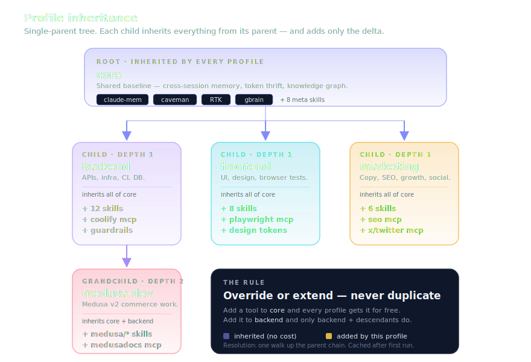

<p align="center">
  
</p>

<p align="center">
  <a href="https://www.npmjs.com/package/cue-ai"></a>
  <a href="https://www.npmjs.com/package/cue-ai"></a>
  <a href="https://github.com/recodeee/cue/stargazers"></a>
  <a href="https://github.com/recodeee/cue/commits/main"></a>
  <a href="./LICENSE"></a>
</p>

# cue — Agent Profile Manager for Claude Code, Codex & 8 more

> Every `claude` session loads **all** your skills, MCPs, and plugins — every one you've ever installed. Your model picks the wrong tool. Your tokens evaporate. **cue fixes this in one command.**

**Works with:** [](https://github.com/anthropics/claude-code) [](https://github.com/openai/codex) [](https://cursor.sh) [](https://github.com/cline/cline) [](https://github.com/google-gemini/gemini-cli) [](https://github.com/features/copilot) [](https://windsurf.com) [](https://github.com/RooVetGit/Roo-Code) [](https://sourcegraph.com/amp) [](https://aider.chat) &nbsp;→&nbsp; [full matrix ↓](#agents-cue-supports)

## ⚡ 60-second quickstart

```bash
npm install -g cue-ai                          # 1. install
cd ~/projects/q4-launch && echo marketing > .cue-profile   # 2. pin a profile to this repo
claude                                         # 3. boots with only the marketing loadout
```

That's it. `cd` into any other repo and `claude` will boot with that repo's profile instead — no flags, no env vars, no daemon.

<p align="center">
  
</p>

<details>
<summary>📑 <b>Table of contents</b></summary>

- [5 commands you need](#-5-commands-you-need)
- [Before & After — token cost](#-before--after--token-cost)
- [Why a profile manager at all?](#why-a-profile-manager-at-all)
- [Skills are not just prompts](#skills-are-not-just-prompts)
- [How cue compares](#how-cue-compares)
- [How it works](#how-it-works)
- [Agents cue supports](#agents-cue-supports)
- [`cue optimizer` — see every loadout at a glance](#cue-optimizer--see-every-loadout-at-a-glance)
- [The 23-profile catalog](#the-23-profile-catalog)
- [Create your own profile in 30 seconds](#️-create-your-own-profile-in-30-seconds)
- [`cue share` — community profiles](#-cue-share--community-profiles)
- [Install](#install)
- [What ships with each profile](#what-ships-with-each-profile-the-lean-stack)
- [FAQ](#faq)
- [Repo layout](#repo-layout)
- [Built with / built on](#built-with--built-on)
- [Star History](#star-history)
- [Contributing](#contributing)

</details>

---

## 🧠 5 commands you need

```bash
cue use <profile>            # switch profile for this directory
cue list                     # see all available profiles
cue optimizer                # audit: skills, MCPs, CLIs, usage per profile
cue doctor --fix             # diff declared vs actual state, auto-repair
cue skills add <github-url>  # install a skill from GitHub into a profile
```

That covers 90% of daily use. Everything else (`cue share`, `cue materialize`, `cue tree`, etc.) is there when you need it — run `cue --help` for the full list.

---

## 📊 Before & After — token cost

> **TL;DR** — loading everything costs you tokens on every single message. cue cuts context size by 10–25×.

| Scenario | Context loaded | Tokens per session | Cost (Sonnet) |
|---|---|---|---|
| **Without cue** — all 1,927 skills + 15 MCPs | ~180k tokens | ~$2.70/session | 😱 |
| **With cue** — `backend` profile (12 skills, 2 MCPs) | ~8k tokens | ~$0.12/session | ✅ |
| **With cue** — `caveman-quick` (3 skills, 0 MCPs) | ~2k tokens | ~$0.03/session | 🚀 |

That's **22× fewer tokens** for a typical backend session. Over a day of 20 sessions, you save ~$50 in raw API cost — or equivalently, your model picks the right tool on the first try because it's not drowning in 1,900 irrelevant skill descriptions.

```bash
cue cost                      # see token budget for your active profile
cue cost --profile full       # compare against the "everything" baseline
```

---

## Why a profile manager at all?

> **TL;DR** — without cue, every `claude` session loads every skill, MCP, and plugin you've ever installed. cue scopes the loadout per-directory so each repo only sees what it actually needs.

<p align="center">
  
</p>

- **Per-profile isolation.** Skills, MCP servers, and Claude Code plugins are scoped to the active profile. Marketing work doesn't see frontend's MCPs; backend doesn't see design's skills. No more "every session has every tool" overload.
- **Directory-aware.** Pin a profile to a directory (`.cue-profile`), and every `claude` / `codex` you launch from inside boots with that loadout automatically. No flag wrangling.
- **Composable.** Profiles inherit from a `core` baseline so cross-session memory (claude-mem) and meta skills are shared by default. Add team-wide tools in one place.
- **Pre-launch picker.** First time you type `claude` in a fresh directory, a TUI picker opens. Pin or one-shot — your choice.
- **Materialized, hash-short-circuited.** Each launch rebuilds the runtime only when the resolved profile actually changed. Cold-start cost is a `stat()` + sha256 compare.
- **No service to run.** No daemon, no background process, no auto-update. Just a Bun CLI and a shim script in `~/.local/bin`.

### Profile inheritance

Profiles compose via single-parent inheritance. Each child adds or overrides what it needs:

<p align="center">
  
</p>

Child profiles inherit all skills, MCPs, and plugins from their parent. Override or extend — never duplicate.

---

## Skills are not just prompts

> **TL;DR** — a cue skill isn't a markdown file the model reads and forgets. It's a **wired capability** — a skill declares which CLIs it needs, which MCP tools it calls, and cue ensures all three layers (skill + MCP + CLI) are present and connected before the session starts.

Most "skill" tools stop at prompt injection: paste markdown into the context window and hope the model follows it. That works for style guides. It doesn't work for *doing things*.

A real capability has three layers:

| Layer | What it does | Example |
|---|---|---|
| **Skill** (the instruction) | Tells the model *when* and *how* to act | "When user says 'analyze video', extract frames at 1 fps…" |
| **MCP server** (the tool + context) | Gives the model callable functions *and* domain knowledge — tools for action, resources/prompts for expertise | `video_watch`, `gbrain__put_page`, `reddit__search_reddit` |
| **CLI** (the runtime) | The binary the MCP or skill shells out to | `ffmpeg`, `yt-dlp`, `whisper-cpp`, `uv` |

**Without cue**, you install these independently and pray they line up. A skill references an MCP that isn't running. An MCP calls a CLI that isn't installed. The model hallucinates a tool name because 40 other MCPs are polluting the namespace.

**With cue**, a profile declares all three as a unit:

```yaml
# profiles/video/profile.yaml
skills:
  local:
    - design/headless-gif-demo     # ← knows it needs ffmpeg
plugins:
  - claude-video-vision@jordanrendric  # ← registers video_watch MCP
mcps: []                               # ← inherited gbrain from core
```

`cue optimizer` then verifies the full stack:

```
video profile
  ✅ ffmpeg        installed (/usr/bin/ffmpeg)
  ✅ yt-dlp        installed (~/.local/bin/yt-dlp)
  ❌ whisper-cpp   missing → brew install whisper-cpp
  ✅ MCP: video_watch (claude-video-vision plugin)
  ✅ MCP: gbrain (inherited from core)
```

**The result:** when the model receives a skill, it's not reading a suggestion — it's reading a contract backed by tools that are actually there. Skills become reliable capabilities, not hopeful prompts.

---

## How cue compares

> **TL;DR** — `claude-code-switcher` swaps MCPs only; `skillport` / `skillshub` / `agent-skills-cli` / `agent-skill-manager` / `add-skills` deliver skills only; Kiro Powers is IDE-locked. **cue is the only tool that composes skills + MCPs + plugins together, per-directory, with inheritance and materialized isolation.**

<p align="center">
  
</p>

Several tools touch parts of the problem — switching MCP configs, distributing skills, installing from marketplaces. **cue is the only one that treats the full agent loadout (skills + MCPs + plugins) as a composable, inheritable, directory-aware profile system.**

Quick links to each tool: [`claude-code-switcher`](https://github.com/search?q=claude-code-switcher) · [`skillport`](https://github.com/search?q=skillport) · [`agent-skills-cli`](https://github.com/search?q=agent-skills-cli) · [`agent-skill-manager`](https://pypi.org/project/agent-skill-manager/) · [`skillshub`](https://github.com/search?q=skillshub) · [`add-skills`](https://github.com/search?q=add-skills) · **Kiro Powers** (IDE-only).

<details>
<summary>📊 <b>Same matrix as a markdown table</b> (for screen readers / LLM ingestion)</summary>

| Tool | skills | MCPs | plugins | profiles | per-dir | isolation | inherit |
|---|---|---|---|---|---|---|---|
| **cue** | ✅ | ✅ | ✅ | ✅ | ✅ | ✅ | ✅ |
| claude-code-switcher | — | ✅ | — | ◐ | — | — | — |
| skillport | ✅ | — | — | — | — | — | — |
| agent-skills-cli | ✅ | — | — | — | — | — | — |
| agent-skill-manager | ✅ | — | — | — | — | — | — |
| skillshub | ✅ | — | — | — | — | — | — |
| add-skills | ✅ | — | — | — | — | — | — |
| Kiro Powers | ✅ | ✅ | — | — | ◐ | — | — |

Canonical source: [`docs/data/comparison.md`](./docs/data/comparison.md).

</details>

**Where cue is the only one:**

1. **`.cue-profile` per-directory pinning** — `cd` into a repo, the right loadout loads automatically.
2. **Materialized isolation** — builds a real `CLAUDE_CONFIG_DIR` per profile, not just a config swap.
3. **Hash-cached rebuilds** — content-addressed sha256 check, <5 ms when unchanged.
4. **Three dimensions as one unit** — skills + MCPs + plugins composed together. Others manage one at a time.
5. **Inheritance with merge semantics** — `core → backend → medusa-dev` chains; child overrides parent cleanly.
6. **Shim-based interception** — type `claude` like always. The right environment just shows up.
7. **No daemon** — pure CLI, no background process, nothing to monitor.
8. **`cue optimizer` dashboard** — visual audit of every profile's loadout, install status, and per-skill usage scanned from your actual session transcripts.

---

## How it works

> **TL;DR** — three steps on every `claude`/`codex` invocation: **resolve** the profile from `.cue-profile` (walks up to `$HOME`), **materialize** `~/.config/cue/runtime/<profile>/` if the content hash changed, then **exec** the real binary with `CLAUDE_CONFIG_DIR` / `CODEX_HOME` set.

<p align="center">
  
</p>

Typing `claude` or `codex` in a repo where cue's shims are installed triggers a three-step launch flow:

1. **Resolve** — cue checks for a `.cue-profile` file in the current directory (or any parent up to `$HOME`). If none is found, it falls back to a repo-level default, a global default, or opens the TUI picker.
2. **Materialize** — cue builds `~/.config/cue/runtime/<profile>/{claude,codex}/` with a content-addressed hash check. If the profile hasn't changed, this is a no-op.
3. **Exec** — the real `claude` or `codex` binary is launched with `CLAUDE_CONFIG_DIR` (or `CODEX_HOME`) pointing at the materialized runtime tree.

Full resolve-precedence rules and bypass paths: **[docs/launch.md](./docs/launch.md)**.

---

## Agents cue supports

> **TL;DR** — **10 agents**: Claude Code, Codex, Cursor, Cline, Gemini CLI, GitHub Copilot, Windsurf, Roo Code, Sourcegraph Amp, Aider. One `profile.yaml` materializes into each agent's native format (`.cursorrules`, `.clinerules`, `~/.gemini/skills/*.md`, `.github/copilot-instructions.md`, etc.).

Originally built for Claude Code & Codex — now **one profile, ten agents**. The same `profile.yaml` (skills + MCPs) materializes into the exact format each agent expects.

```bash
cue materialize cursor --profile backend     # → .cursorrules + .cursor/mcp.json
cue materialize cline  --profile backend     # → .clinerules + cline_mcp_settings.json
cue materialize --all  --profile backend     # → all agents in this profile
```

| Agent | `cue materialize` command | What gets written |
|---|---|---|
| **Claude Code** | (default — uses shim) | `~/.config/cue/runtime/<profile>/claude/` |
| **OpenAI Codex** | (default — uses shim) | `~/.config/cue/runtime/<profile>/codex/` |
| **Cursor** | `cue materialize cursor` | `.cursorrules` · `.cursor/mcp.json` |
| **Cline** | `cue materialize cline` | `.clinerules` · `cline_mcp_settings.json` |
| **Google Gemini CLI** | `cue materialize gemini` | `~/.gemini/skills/*.md` |
| **GitHub Copilot** | `cue materialize copilot` | `.github/copilot-instructions.md` |
| **Windsurf** | `cue materialize windsurf` | `.windsurfrules` · `.windsurf/mcp.json` |
| **Roo Code** | `cue materialize roo` | `.roo/rules/*.md` · `.roo/mcp.json` |
| **Sourcegraph Amp** | `cue materialize amp` | `AGENTS.md` · `.amp/mcp.json` |
| **Aider** | `cue materialize aider` | `.aider.conventions.md` |

Each adapter writes skills + MCPs in the precise format that agent expects — Cursor's `.cursorrules` syntax, Gemini's per-skill markdown, Copilot's instruction file, etc. **Same profiles, same skills, any agent.** Switch from Claude Code to Cursor on the same repo without touching a single skill definition.

See [`src/commands/materialize.ts`](./src/commands/materialize.ts) for the full flag set (`--all`, `--profile`, `--dir`, dry-run).

---

## `cue optimizer` — see every loadout at a glance

> **TL;DR** — `cue optimizer` prints a visual audit of every profile: skills loaded, MCP servers, required CLIs (install status ✅/❌), GitHub sources, and per-skill usage bars computed from your local session transcripts. No telemetry.

Run it once and you get a dashboard of every profile: skills (with per-session usage), MCP servers, required CLIs (with install status ✅/❌), GitHub sources, and brand icons.

<p align="center">
  
</p>

What the optimizer scans for you:

- Every `profile.yaml` (inheritance resolved, `*` wildcards expanded)
- Each skill's frontmatter for `allowed-tools` and `## Prerequisites` → required CLIs
- `which <cli>` for every CLI → install status per profile
- `~/.claude/projects/**/*.jsonl` → per-skill usage counts across all sessions
- `~/skills-lock.json` → which GitHub repo each skill came from

### Terminal output

<p align="center">
  
</p>

> 🐱 **Recommended terminal: [Kitty](https://sw.kovidgoyal.net/kitty/).** cue's optimizer renders bar charts, gradients, brand glyphs, and inline images via the Kitty graphics protocol. It also works in [WezTerm](https://wezfurlong.org/wezterm/) and [Ghostty](https://ghostty.org/) — but inside macOS Terminal or stock `gnome-terminal` you'll see the ASCII fallback (still readable, just less pretty).

```bash
cue optimizer                 # all profiles
cue optimizer backend         # just one
cue optimizer --expand        # expand grouped skills (useful for cybersecurity's 754)
```

### A single profile, expanded

<p align="center">
  
</p>

Each card shows what's actually loaded *plus* how often you've reached for each skill. The bar chart is computed from your local session transcripts — no telemetry leaves the machine.

---

## The 23-profile catalog

> **TL;DR** — 23 profiles ship with cue: `core`, `backend`, `frontend`, `nextjs`, `python-api`, `rust`, `go-api`, `marketing`, `medusa-dev`, `cybersecurity`, `nvidia`, `creative-media`, `docs-writer`, `caveman-quick`, `coolify`, `hostinger`, `fleet-control`, `readme-writer`, `full`, `research`, `threejs`, `video`, `affiliate`, plus the per-OS `setup` profile. Switch with `cue use <name>`.

<p align="center">
  
</p>

<details>
<summary>📋 <b>All 23 profiles as a table</b> (for screen readers / LLM ingestion)</summary>

| Profile | Domain |
|---|---|
| `core` | Baseline shared by every profile — claude-mem, caveman, RTK, gbrain. |
| `backend` | APIs, webhooks, security review, CI, packaging, databases. |
| `frontend` | UI implementation, redesign, screenshots, browser testing. |
| `marketing` | Copywriting, SEO, CRO, growth, channels, brand. |
| `medusa-dev` | Medusa v2 backend, storefront, admin, migration, shop setup. |
| `cybersecurity` | 754 cybersecurity skills (red/blue team, forensics, DFIR). |
| `nvidia` | NVIDIA cuOpt: routing, LP/MILP, GPU-accelerated optimization. |
| `creative-media` | Image, video, product asset, brand, visual generation. |
| `docs-writer` | Documentation, Markdown, PDF, Obsidian, structured writing. |
| `readme-writer` | Beautiful README design with SVG diagrams. |
| `caveman-quick` | Fast low-context edits, summaries, reviews, notes, commits. |
| `coolify` | Coolify deploys, server config, app env vars, CI. |
| `hostinger` | Hostinger DNS, domain, VPS, hosting management. |
| `fleet-control` | Multi-agent orchestration, Colony coordination, OMX flows. |
| `full` | Diagnostic fallback — loads every local skill and MCP. |
| `research` | Deep research, literature review, citation management. |
| `threejs` | Three.js 3D scenes, shaders, WebGL, interactive visuals. |
| `video` | Video/GIF analysis — frame extraction, transcription, Claude Vision. |
| `affiliate` | Affiliate marketing, link management, conversion tracking. |
| `nextjs` | Next.js full-stack — App Router, Server Components, API routes, Vercel. |
| `python-api` | Python API — FastAPI, Django, Flask, SQLAlchemy, Alembic, pytest. |
| `rust` | Rust — cargo, async, traits, error handling, CLI tools, systems. |
| `go-api` | Go API — net/http, gin/echo/chi, GORM, migrations, testing. |
| `setup` | Per-OS install assistant. |

Canonical source: [`docs/data/profiles.md`](./docs/data/profiles.md).

</details>

```bash
cue list                      # show all
cue use medusa-dev            # pin to current directory
claude                        # launches with medusa-dev's loadout
```

---

## 🛠️ Create your own profile in 30 seconds

```bash
cue new my-stack                              # scaffold profile.yaml
```

Edit the generated file:

```yaml
# profiles/my-stack/profile.yaml
name: my-stack
icon: "🔧"
description: My custom dev environment
inherits: core                                # gets claude-mem, caveman, RTK, gbrain
skills:
  local:
    - review/code-review
    - meta/rtk-context-trim
mcps:
  - gbrain
```

Activate it:

```bash
cue use my-stack                              # pin to current directory
cue doctor --fix                              # verify everything resolves
claude                                        # launches with your loadout
```

Want to start from what's already in a project? `cue init` scans your repo and suggests a profile based on detected languages, frameworks, and config files.

---

## 🌐 `cue share` — community profiles

> **TL;DR** — publish your profile as a GitHub Gist, browse what others have shared, install with one command.

```bash
cue share publish --profile backend           # upload to your GitHub Gists
cue share browse                              # see community profiles
cue share install <gist-id>                   # pull someone else's profile
```

Shared profiles include the full `profile.yaml` + metadata (skill count, MCP list, description). Browse profiles others have published, fork them, or use them as a starting point for your own.

---

## Install

> **TL;DR** — `npm install -g cue-ai`, then `echo <profile> > .cue-profile` in any repo. Idempotent. No daemon. Uninstall with `install.sh --uninstall`.

```bash
npm install -g cue-ai
```

That's it. Then in any project:

```bash
cd ~/projects/q4-launch
echo marketing > .cue-profile
claude
```

**Other install paths** (pick what you prefer):

| Path | Command |
|---|---|
| **One-line script** | `curl -fsSL https://raw.githubusercontent.com/recodeee/cue/main/get.sh \| bash` |
| **Manual clone** | `git clone https://github.com/recodeee/cue.git ~/Documents/cue && ~/Documents/cue/install.sh` |
| **Per-OS bootstrap (agent-driven)** | paste [`setup/macos.md`](./setup/macos.md) · [`setup/linux.md`](./setup/linux.md) · [`setup/windows.md`](./setup/windows.md) into Claude Code |

`install.sh --help` lists `--yes`, `--codex`, `--uninstall`. Idempotent — safe to re-run.

---

## What ships with each profile (the lean stack)

| Layer | What it does |
|---|---|
| **claude-mem** plugin | Passive observation capture; `mem-search "topic"` recalls across sessions |
| **caveman** plugin | `/caveman` terse mode, `/caveman-commit` Conventional Commits |
| **RTK** CLI hook | Filters shell output — 60-90% token savings on `ls` / `git` / `cat` |
| **gbrain** MCP | Personal wiki with embeddings + backlinks |
| **excel-mcp** / **word-mcp** | Native `.xlsx` / `.docx` read & write |

### 💰 Token savings stack

The combination of **profile isolation + RTK + caveman** compounds:

| Optimization | What it cuts | Savings |
|---|---|---|
| **Profile isolation** | Irrelevant skills/MCPs never loaded | 10–25× fewer context tokens |
| **RTK** | Filters `ls`, `git log`, `cat` output before it hits the model | 60–90% per shell command |
| **Caveman mode** | Terse responses, no filler | ~40% fewer output tokens |
| **Combined** | All three together | **$2.70 → $0.08/session** typical |

```bash
rtk gain                      # see your cumulative RTK savings
cue cost                      # token budget for active profile
```

Want to **run 2+ agents in parallel on one repo**? Layer the optional **Colony + gitguardex** tier — see [`setup/parallel-agents.md`](./setup/parallel-agents.md). Skip it for solo work.

---

## FAQ

<details>
<summary><b>Why not just use <code>~/.claude/</code> like everyone else?</b></summary>

That's exactly the problem cue solves. `~/.claude/` is one global folder shared across every repo, so every session loads every skill, every MCP, and every plugin you've ever installed. The model burns tokens picking through irrelevant tools and frequently picks the wrong one. cue gives each project its own isolated `CLAUDE_CONFIG_DIR` materialized just-in-time — only what that project needs.
</details>

<details>
<summary><b>Does this break Claude Code's auto-update?</b></summary>

No. cue doesn't touch the `claude` binary — it just intercepts the *call*, sets `CLAUDE_CONFIG_DIR`, and execs the real binary at the end of the shim. Claude Code's update mechanism still runs the same way.
</details>

<details>
<summary><b>Can I use cue with only Codex (no Claude Code)?</b></summary>

Yes. Run `cue shell install --codex-only` (or skip the `claude` shim during interactive install). cue scopes resources per-agent in `profile.yaml`, so a Codex-only profile only materializes `CODEX_HOME`.
</details>

<details>
<summary><b>What if I only want one global profile and never want to think about this?</b></summary>

Set a global default with `cue use <profile> --global`. cue will use it for every directory that doesn't have its own `.cue-profile`. The picker stops appearing.
</details>

<details>
<summary><b>Is this a daemon or background service?</b></summary>

No. cue is a pure CLI — when you type `claude`, the shim runs `cue launch`, which does a `stat()` + sha256 compare, materializes the runtime if anything changed (else no-op), and then `exec`s the real binary. Nothing stays resident. Nothing to monitor. Nothing to `systemctl restart`.
</details>

<details>
<summary><b>How fast is the launch overhead?</b></summary>

Cold start (first launch of a new profile): typically 50–200 ms depending on how many skills + MCPs are linked. Warm start (profile unchanged): &lt;5 ms — just a sha256 compare and an `exec`. Both are imperceptible vs. Claude Code's own startup.
</details>

<details>
<summary><b>Does cue send telemetry anywhere?</b></summary>

No. Everything cue computes (including the per-skill usage bars in `cue optimizer`) is read from your local `~/.claude/projects/**/*.jsonl` session transcripts. Nothing leaves the machine.
</details>

<details>
<summary><b>What does cue NOT do?</b></summary>

- It does not modify or repackage the Claude Code / Codex binary.
- It does not host a remote skill marketplace — skills live in your repo or come from [open-source sources](#built-with--built-on).
- It does not coordinate multi-agent runs (that's [`recodeee/colony`](https://github.com/recodeee/colony) + [`gitguardex`](https://github.com/recodeee/gitguardex), layered on top via the parallel-agents tier).
- It does not auto-pick a profile from repo contents — you pin once with `echo <profile> > .cue-profile`. (A scan-to-profile flow is on the roadmap.)

</details>

---

## Repo layout

```
cue/
├── profiles/        one dir per profile, YAML decides what loads (inheritance, agent scoping)
├── resources/
│   ├── skills/      110+ local skills (medusa, codex-fleet, higgsfield, caveman, …)
│   ├── mcps/        MCP server configs (claude.sanitized.json, codex.sanitized.json)
│   └── icons/       brand icons used in the optimizer dashboard
├── plugins/cue/     the Claude Code plugin: /cue, /cue switch, /cue reload, /cue current
├── src/             the Bun CLI — commands/{optimizer,launch,picker,…}, lib/runtime-materializer
├── setup/           paste-into-agent install prompts (macos, linux, windows, parallel-agents)
└── docs/            launch.md, shell-install.md, assets/ (the SVGs in this README)
```

Full docs: **[docs/launch.md](./docs/launch.md)** (resolve → materialize → exec flow) · **[docs/profiles/](./docs/profiles/)** (schema, inheritance, scan-to-profile, troubleshooting) · **[AGENTS.md](./AGENTS.md)** (bootstrap contract for AI agents).

---

## Built with / built on

cue glues together a small set of excellent open-source projects. Star counts are live from GitHub.

**Runtime & dependencies (the CLI itself):**

| Project | What we use it for | |
|---|---|---|
| [oven-sh/bun](https://github.com/oven-sh/bun) | TypeScript runtime that ships `bin/cue` | [](https://github.com/oven-sh/bun) |
| [natemoo-re/clack](https://github.com/natemoo-re/clack) | `@clack/prompts` powers the TUI profile picker | [](https://github.com/natemoo-re/clack) |
| [ajv-validator/ajv](https://github.com/ajv-validator/ajv) | JSON Schema validation for `profile.yaml` | [](https://github.com/ajv-validator/ajv) |
| [eemeli/yaml](https://github.com/eemeli/yaml) | YAML parsing for profile definitions | [](https://github.com/eemeli/yaml) |

**Built-in terminal integration:**

| Project | What we use it for | |
|---|---|---|
| [kovidgoyal/kitty](https://github.com/kovidgoyal/kitty) | **Kitty graphics protocol** — inline brand logos & profile icons rendered directly in the terminal (see [`src/lib/kitty-image.ts`](./src/lib/kitty-image.ts), spec [here](https://sw.kovidgoyal.net/kitty/graphics-protocol/)). Auto-detected; falls back to emoji if you're not on Kitty. | [](https://github.com/kovidgoyal/kitty) |

**Agents we shim:**

| Project | Role | |
|---|---|---|
| [anthropics/claude-code](https://github.com/anthropics/claude-code) | The `claude` binary cue intercepts and re-launches with `CLAUDE_CONFIG_DIR` | [](https://github.com/anthropics/claude-code) |
| [openai/codex](https://github.com/openai/codex) | The `codex` binary cue intercepts and re-launches with `CODEX_HOME` | [](https://github.com/openai/codex) |

**Skill packs & sister tools:**

| Project | Role | |
|---|---|---|
| [mukul975/Anthropic-Cybersecurity-Skills](https://github.com/mukul975/Anthropic-Cybersecurity-Skills) | 754 cybersecurity skills (red/blue team, forensics, DFIR) loaded by the `cybersecurity` profile | [](https://github.com/mukul975/Anthropic-Cybersecurity-Skills) |
| [recodeee/colony](https://github.com/recodeee/colony) | Local-first MCP for multi-agent coordination — used by the `fleet-control` profile | [](https://github.com/recodeee/colony) |
| [recodeee/gitguardex](https://github.com/recodeee/gitguardex) | `gx` CLI for branch + worktree isolation when running 2+ agents on one repo | [](https://github.com/recodeee/gitguardex) |
| [rtk-ai/rtk](https://github.com/rtk-ai/rtk) | Token-savings hook on shell output (60–90% reduction on `ls`/`git`/`cat`) | [](https://github.com/rtk-ai/rtk) |
| [astral-sh/uv](https://github.com/astral-sh/uv) | Python venv manager used by `setup/<os>.md` to run uvx-based MCP servers (Excel / Word) | [](https://github.com/astral-sh/uv) |

Plus the **brand logos** you see in the optimizer dashboard and hero come from each vendor's official press kit (OpenAI, NVIDIA, Hostinger, Coolify, Medusa, Stripe, Higgsfield, Obsidian) — see [`resources/icons/`](./resources/icons/).

---

## Who uses cue

Projects and teams using `.cue-profile` in production:

| Project | Profile | What they do |
|---------|---------|-------------|
| [recodeee/cue](https://github.com/recodeee/cue) | `full`, `readme-writer` | This repo — dogfooding cue on itself |
| [recodeee/colony](https://github.com/recodeee/colony) | `fleet-control` | Multi-agent coordination MCP |
| [recodeee/gitguardex](https://github.com/recodeee/gitguardex) | `backend` | Branch + worktree isolation for parallel agents |

> **Using cue?** Add your project — open a PR or drop a link in [Discussions](https://github.com/recodeee/cue/discussions).

---

## Star History

<a href="https://star-history.com/#recodeee/cue&Date">
  <picture>
    <source media="(prefers-color-scheme: dark)" srcset="https://api.star-history.com/svg?repos=recodeee/cue&type=Date&theme=dark" />
    <source media="(prefers-color-scheme: light)" srcset="https://api.star-history.com/svg?repos=recodeee/cue&type=Date" />
    
  </picture>
</a>

---

## Who uses cue

Projects and teams using `.cue-profile` in production:

| Project | Profile | What they do |
|---------|---------|-------------|
| [recodeee/cue](https://github.com/recodeee/cue) | `full`, `readme-writer` | This repo — dogfooding cue on itself |
| [recodeee/colony](https://github.com/recodeee/colony) | `fleet-control` | Multi-agent coordination MCP |
| [recodeee/gitguardex](https://github.com/recodeee/gitguardex) | `backend` | Branch + worktree isolation for parallel agents |

> **Using cue?** Add your project — open a PR or drop a link in [Discussions](https://github.com/recodeee/cue/discussions).

---

## Contributing

Each skill is a folder with `SKILL.md` (frontmatter + body). The frontmatter `description` is what the LLM matches against — write it as `"when user says X, do Y"`. Copy an existing skill as a template, drop it under `resources/skills/skills/<category>/<slug>/`, and the catalog regenerates on the next sync.

The SVGs in this README live in [`docs/assets/`](./docs/assets/) — edit the XML directly or regenerate from the `readme-writer` profile.

License: [MIT](./LICENSE).
